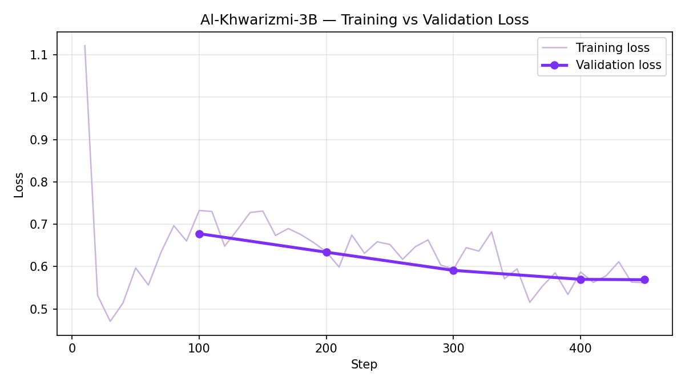

# Al-Khwarizmi-3B

A math-reasoning fine-tune of **HuggingFaceTB/SmolLM3-3B-Base**, trained to solve grade-school math word problems with clear, step-by-step reasoning.

Named after Muhammad ibn Musa al-Khwarizmi, the 9th-century mathematician whose name is the direct origin of the word "algorithm."

## Highlights

- **84.75% mean token accuracy** on held-out validation data, up from 82.4% at the first checkpoint
- **Validation loss reduced by ~16%** (0.678 → 0.569) over training, with training and validation loss tracking closely throughout — no overfitting observed
- Full fine-tune (not adapter-based) on 900 GSM8K examples, 1 epoch, cosine LR schedule



## Training Details

| | |
|---|---|
| Base model | HuggingFaceTB/SmolLM3-3B-Base |
| Dataset | GSM8K (`openai/gsm8k`, `main`), 1,000 random samples, 90/10 train/val split |
| Method | Full supervised fine-tuning |
| Steps | 450 (1 epoch) |
| Learning rate | 5e-5, cosine schedule, 50 warmup steps |
| Effective batch size | 4 |
| Precision | bfloat16 |
| Final training loss | 0.562 |
| Final validation loss | 0.569 |
| Final validation accuracy | 84.75% |

## Limitations

Fine-tuned primarily on GSM8K-style problems (single correct numeric answer, grade-school arithmetic/word problems) — performance on more complex, multi-part, or differently-structured math problems is untested.

## Usage

```python
from transformers import AutoModelForCausalLM, AutoTokenizer
import torch

model_name = "mzoelfakar/Al-Khwarizmi-3B"
tokenizer = AutoTokenizer.from_pretrained(model_name)
model = AutoModelForCausalLM.from_pretrained(model_name, dtype=torch.bfloat16, device_map="auto")

messages = [
    {"role": "system", "content": "You are a math tutor. Solve problems step by step."},
    {"role": "user", "content": "If a train travels 120 miles in 2 hours, what is its average speed?"}
]
prompt = tokenizer.apply_chat_template(messages, tokenize=False, add_generation_prompt=True)
inputs = tokenizer(prompt, return_tensors="pt").to(model.device)
outputs = model.generate(**inputs, max_new_tokens=300, temperature=0.7, do_sample=True)
print(tokenizer.decode(outputs[0], skip_special_tokens=True))
```

## Credits

Fine-tuned by [Mohamed Zoelfakar](https://www.linkedin.com/in/mzoelfakar/), as part of Hugging Face's [smol-course](https://huggingface.co/learn/smol-course/).
